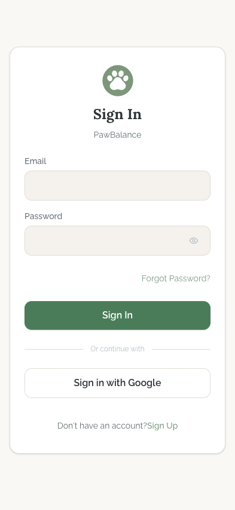
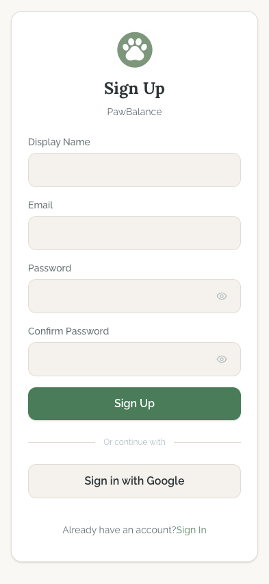
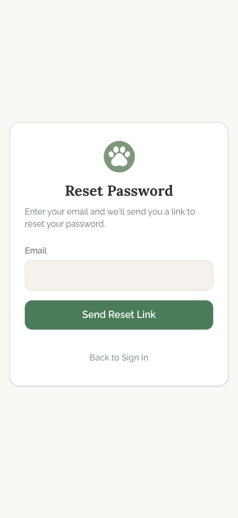

# Auth Flow

## Flow Overview

The auth flow handles user authentication for PawBalance. It consists of three screens -- Login, Register, and Forgot Password -- all rendered inside a shared auth layout (`src/app/(auth)/layout.tsx`) that centers a white card on the warm beige canvas background.

**Entry points:**
- New users arriving from the Welcome screen "Sign In" link land on Login with a `?redirect=/search` query param.
- New users tapping "Get Started" on Welcome go through Onboarding first, then are prompted to sign up.
- Direct navigation to `/login`, `/register`, or `/forgot-password`.

**Auth guard:** If the user already has an active session, the auth layout automatically redirects to `/search` (or the `?redirect` param value) and renders nothing.

**Loading state:** While the auth store is hydrating, a centered spinning indicator is shown on the canvas background.

---

## Screens

### Login

**Purpose:** Authenticate existing users via email/password or Google (Apple Sign-In on native iOS only).

**Key Elements:**
- PawBalance app icon (64x64, rounded-2xl) centered at the top
- "Sign In" heading in bold 2xl text with "PawBalance" subtitle in secondary text
- Email input field with label
- Password input field with label and visibility toggle icon (eye icon on the right)
- "Forgot Password?" link aligned to the right below the password field
- Full-width sage green "Sign In" primary button
- "Or continue with" divider line with text
- "Sign in with Google" outline button (full width)
- "Don't have an account? Sign Up" text link at the bottom

**Interactions:**
- Email and password fields accept text input; email field triggers email keyboard via `type="email"`
- Password toggle (eye icon) reveals/hides the password
- "Sign In" button submits the form; shows a loading spinner while the request is in flight and disables the button
- Error messages appear between the password field and the submit button in red text
- "Forgot Password?" navigates to `/forgot-password`
- "Sign in with Google" triggers Google OAuth flow
- "Sign Up" navigates to `/register`

**Transitions:**
- Successful sign-in redirects to `/search` (or the `?redirect` param)
- "Forgot Password?" -> Forgot Password screen
- "Sign Up" -> Register screen

---

### Register

**Purpose:** Create a new PawBalance account with email/password and optional display name.

**Key Elements:**
- PawBalance app icon (64x64, rounded-2xl) centered at the top
- "Sign Up" heading in bold 2xl text with "PawBalance" subtitle
- Display Name input field with label
- Email input field with label
- Password input field with label and visibility toggle
- Confirm Password input field with label and visibility toggle
- Full-width sage green "Sign Up" primary button
- "Or continue with" divider
- "Sign in with Google" outline button
- "Already have an account? Sign In" text link at the bottom

**Interactions:**
- All four fields are required; the form validates client-side before submission
- Password must be at least 6 characters; an error is shown if too short
- Confirm Password must match Password; a mismatch error is shown inline
- "Sign Up" button shows loading state during the async request
- Error messages appear in red text below the Confirm Password field
- "Sign in with Google" triggers the same OAuth flow as on Login
- "Sign In" navigates back to `/login`

**Transitions:**
- Successful registration redirects to the onboarding flow or `/search`
- "Sign In" -> Login screen

---

### Forgot Password

**Purpose:** Allow users to request a password reset email.

**Key Elements:**
- PawBalance app icon (64x64, rounded-2xl) centered at the top
- "Reset Password" heading in bold 2xl text
- Descriptive paragraph: "Enter your email and we'll send you a link to reset your password."
- Email input field with label
- Full-width sage green "Send Reset Link" primary button
- "Back to Sign In" text link below the button

**Interactions:**
- Email field is required and triggers email keyboard
- "Send Reset Link" shows loading state during the request
- On success, the entire form is replaced by a confirmation view with a mail icon in a green circle, "Check Your Email" heading, descriptive text, and a "Back to Sign In" link
- Error messages appear in red between the email field and the submit button

**Transitions:**
- Success -> "Check Your Email" confirmation state (same URL, different render)
- "Back to Sign In" -> Login screen

---

## State Variations

| State | Behavior |
|-------|----------|
| **Session loading** | Full-screen centered spinner on canvas background (auth layout Suspense fallback) |
| **Already authenticated** | Immediate redirect to `/search` or `?redirect` param; renders null |
| **Form submitting** | Primary button shows loading spinner and is disabled |
| **Validation error (Register)** | Red text below form fields: "Password must be at least 6 characters" or "Passwords do not match" |
| **Server error** | Red error text below the form fields with the server's error message or a generic fallback |
| **Reset email sent** | Form is replaced by a success view with mail icon, heading, and back link |

---

## UI/UX Improvement Suggestions

### Critical

- **Error messages lack `role="alert"` on Login and Register pages.** The inline `
` elements for form errors on Login (line 61) and Register (line 84) do not use `role="alert"` or `aria-live="assertive"`, so screen readers will not announce errors when they appear. The Input component already implements `role="alert"` on its own error messages, but the form-level errors bypass this. Every dynamic error message should be announced to assistive technology.

- **No visible focus indicator on the "Forgot Password?" link in the Login form.** The link uses the default `text-sm text-primary hover:underline` styles but lacks `focus-visible:ring-*` or `focus-visible:underline` styles. Keyboard users cannot see which element is focused. Compare this to the Forgot Password page where the "Back to Sign In" link does include `focus-visible:ring-2 focus-visible:ring-primary`. Apply consistent focus styles to all interactive elements.

### High

- **Google Sign-In button has no brand icon.** The "Sign in with Google" button is a plain outlined button with text only. Users expect the recognizable Google "G" logo next to the text, which improves trust and recognition. Adding an inline SVG of the Google logo (from Simple Icons) to the left of the label would match established conventions and reduce hesitation.

- **No password strength indicator on Registration.** The Register form enforces a minimum of 6 characters but gives no real-time feedback about password strength. Adding a simple strength meter (weak/fair/strong) below the password field would help users choose better passwords and reduce frustration from hidden requirements.

- **Register screen is tall and may require scrolling on smaller devices.** With four input fields, a submit button, a divider, a social login button, and a navigation link, the Register form is significantly taller than Login. On iPhone SE or similar smaller screens, the card may overflow the viewport. Consider reducing vertical spacing between fields or allowing the card to scroll naturally within the viewport.

- **No Apple Sign-In button visible in the iOS screenshot.** The `SocialLoginButtons` component conditionally renders Apple Sign-In only when `isNative` is true. However, the screenshot appears to have been taken inside the Capacitor/iOS context and still shows only Google. If Apple Sign-In is required by Apple's App Store guidelines (it is, when other social logins are offered), verify that the `isNative` check is evaluating correctly on Capacitor.

### Medium

- **Input labels use `text-txt-secondary` which may have insufficient contrast.** The labels "Email", "Password", "Display Name", and "Confirm Password" use the secondary text color (`#636E72`). Against the white surface background (`#FFFFFF`), this yields roughly a 4.6:1 contrast ratio, which barely meets WCAG AA for normal text. Bumping label color to `text-txt` (`#2D3436`) would provide a more comfortable contrast ratio of approximately 12:1.

- **"Forgot Password?" link sits very close to the password field.** There is minimal visual separation between the password input and the "Forgot Password?" link. Adding a small top margin (e.g., `mt-1`) or grouping it with the password field more intentionally would clarify the relationship.

- **"Or continue with" divider text is very small (`text-xs`).** At approximately 12px, this text is below the recommended 14px minimum for readable body text on mobile. While it is decorative/supplementary, bumping it to `text-sm` (14px) would improve readability without impacting the layout.

- **No placeholder text in input fields.** All input fields show only a label above and an empty field. Adding subtle placeholder text (e.g., "you@example.com" for email) would give users an additional hint about expected input format, especially useful for the email field.

- **Transitions between auth screens are instantaneous.** Navigating between Login, Register, and Forgot Password has no transition animation. A subtle shared layout animation (e.g., crossfade or slide) would make the flow feel smoother and more polished on mobile, where users expect fluid transitions.
