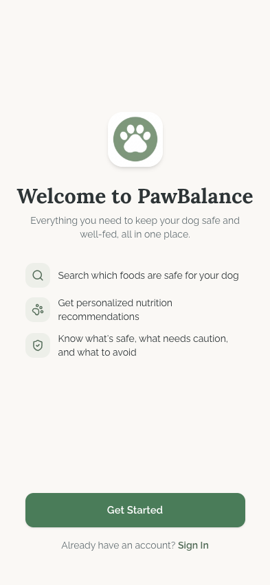

# Guest Flow

## Flow Overview

The Guest flow is the experience presented to unauthenticated users who attempt to access the app. Rather than showing a limited "guest mode" version of the app, PawBalance redirects all unauthenticated users to a welcome/onboarding screen that serves as the primary conversion point from visitor to registered user.

**Entry point:** Any attempt to access the app without an active session (direct URL, app launch without stored credentials, or tapping a protected feature as a guest).

**Exit points:** "Get Started" (registration flow) or "Sign In" (login flow).

---

## Screens

### Welcome / Login Prompt

**Purpose:** Introduce the app's value proposition and convert unauthenticated visitors into registered users. This is the only screen in the guest flow -- it acts as both a landing page and an authentication gate.

**Key Elements:**
- **App icon** -- centered circular icon with a white paw print on a sage-green (#7C9A82) background, matching the app's brand identity. Positioned in the upper-third of the screen for visual hierarchy.
- **Headline** -- "Welcome to PawBalance" in large, bold serif-style text. This is the primary attention anchor.
- **Subheadline** -- "Everything you need to keep your dog safe and well-fed, all in one place." in smaller, muted secondary text. Communicates the core value proposition in one sentence.
- **Feature list** -- three benefit rows, each with a circular icon container and descriptive text:
  1. **Search icon** -- "Search which foods are safe for your dog"
  2. **Paw/nutrition icon** -- "Get personalized nutrition recommendations"
  3. **Shield/safety icon** -- "Know what's safe, what needs caution, and what to avoid"
- **Primary CTA** -- "Get Started" -- full-width sage-green filled button with white text, rounded corners (12px border radius). This is the dominant action, positioned near the bottom of the screen within thumb reach.
- **Secondary CTA** -- "Already have an account? Sign In" -- text link below the primary button. "Sign In" is bold/emphasized to stand out from the surrounding text.
- **Background** -- warm beige canvas (#FAF8F5) consistent with the app's design system.

**Interactions:**
- Tap "Get Started" to enter the registration flow (email/password sign-up or social login).
- Tap "Sign In" to navigate to the login screen for existing users.
- No other interactive elements -- the screen is intentionally focused on these two conversion paths.

**Transitions:**
- Get Started -> Registration screen (sign-up form with social login options)
- Sign In -> Login screen (email/password + social login)

---

## State Variations

| State | Description |
|-------|-------------|
| **Default** | The screen as shown -- clean welcome state with no error messages or loading indicators. |
| **Redirected from protected route** | User tapped a protected feature (e.g., Recipes, Profile) while unauthenticated. The welcome screen appears but currently gives no indication of *why* the user was redirected or what they were trying to access. |
| **After sign-out** | User signed out from the Profile screen. They land on this welcome screen. No "You've been signed out" confirmation is shown. |
| **Deep link entry** | User opens a shared link or deep link to a specific food/recipe. They see this welcome screen instead of the content, with no breadcrumb back to the intended destination after login. |

---

## UI/UX Improvement Suggestions

### Critical

- **No context when redirected from a protected feature.** When a guest user taps "Recipes" or "Profile" in the bottom navigation and gets redirected here, the welcome screen provides no explanation. The user may be confused about why they were sent to this screen. **Fix:** Show a brief contextual message at the top (e.g., "Sign in to access your recipes") or use a bottom sheet overlay on the current screen instead of a full redirect, so the user retains their place in the app.

- **No deep link preservation after authentication.** If a user arrives via a deep link (e.g., a shared food detail URL), they are sent to the welcome screen and, after signing in, are dropped at the default home screen rather than the intended destination. **Fix:** Store the intended URL before redirecting to the welcome screen and navigate to it after successful authentication (standard "return URL" pattern).

### High

- **Feature list icons lack differentiation.** The three feature benefit rows use circular icon containers that are visually similar in size and color. At a glance, all three rows blend together. **Fix:** Use distinct icon colors or slightly varied container styles (e.g., one sage-green, one amber for the safety feature, one muted blue for search) to create visual separation and reinforce each feature's meaning.

- **No social proof or trust signals.** The welcome screen relies entirely on feature descriptions to convince users to sign up. There are no testimonials, user counts, ratings, or veterinary endorsement badges. **Fix:** Add a subtle trust element below the feature list -- e.g., "Trusted by 1,000+ dog owners" or a brief testimonial card. Even a simple app store rating badge would increase conversion confidence.

- **"Get Started" button is positioned low with dead space above.** There is a large empty area between the feature list and the CTA button. On taller devices, this pushes the button further from the content, weakening the visual connection between the value proposition and the action. **Fix:** Reduce the gap between the feature list and the CTA, or add additional content (trust signals, an illustration) to fill the space purposefully.

### Medium

- **No guest browsing option.** The app currently forces authentication before any interaction. Allowing limited guest access (e.g., browse the food safety database, view categories) with a "sign in to save" prompt on write actions (creating recipes, adding pets) would reduce friction and let users experience the app's value before committing to an account. **Fix:** Implement a "Browse as Guest" tertiary link below "Sign In" that grants read-only access to the food search flow. Gate only write/personal features behind authentication.

- **"Already have an account? Sign In" uses a small text link.** The secondary CTA is styled as inline text, which is easy to miss on mobile. Users returning to the app after reinstalling may scan for a sign-in option and not immediately find it. **Fix:** Make "Sign In" a more prominent outlined or bordered button, or at minimum increase the text size and tap target to at least 44px height.

- **No animation or visual engagement.** The welcome screen is entirely static. A subtle entrance animation (fade-in of the icon, staggered reveal of the feature rows) would make the first impression more polished and engaging. **Fix:** Add light CSS animations (opacity + translateY transitions, 200-300ms staggered) with `prefers-reduced-motion` respected for accessibility.

- **Subheadline line length on wider devices.** The subheadline text ("Everything you need to keep your dog safe and well-fed, all in one place.") may stretch beyond the ideal 65-75 character line length on tablets or wider viewports, reducing readability. **Fix:** Constrain the subheadline to a `max-w-xs` or `max-w-sm` container to maintain comfortable reading width across device sizes.

- **No localization hint on the welcome screen.** The app supports English and Turkish, but the welcome screen shows English only with no way to switch language before signing in. Turkish-speaking users must first sign up, navigate to Profile, and change the language. **Fix:** Add a small language toggle (e.g., "TR | EN") in the top-right corner of the welcome screen, or auto-detect the device locale and render the appropriate language.
