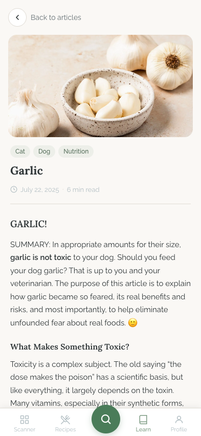

# Learn Article Flow

## Flow Overview

The learn article flow begins from the Learn tab (documented in [`../tabs/README.md`](../tabs/README.md)) where users browse articles via search, tag filters, and a curated list. Tapping any article card or row navigates to the article detail screen at `/learn/article?slug={slug}`. The article page displays the full content with a back button, featured image, tags, title, publication metadata, and the HTML article body rendered through a sanitized prose component.

## Screens

### Article Detail

**Purpose:** Full-content reading screen for a single blog article. Displays the article's featured image, metadata (tags, date, reading time), and rich HTML body in a clean, distraction-free reading layout.

**Key Elements:**
- **Back navigation:** A row at the top-left with:
  - A circular back button (36x36px, rounded-full) containing a left-chevron icon. Has a subtle border, white surface background, hover/active feedback, and a focus-visible ring for keyboard accessibility.
  - "Back to articles" text label in secondary gray next to the button.
- **Featured image:** Full-width image (200px tall) with rounded-card corners (16px), displayed below the back nav with horizontal margin (16px). The image uses `loading="eager"` since it is above the fold. An `alt` attribute is set to the article title.
- **Tag pills:** Small rounded-full chips below the image (e.g., "Nutrition", "Dog") in the primary/10 background with primary-dark text. Spaced with a 6px gap.
- **Article title:** Large heading (22px) in the heading font, bold weight, snug line-height. Placed below tags with 10px bottom margin.
- **Meta line:** A row showing a clock icon, formatted publication date (localized), a dot separator, and reading time (e.g., "5 min read"). Rendered in tertiary text color (13px). Separated from the body by a bottom border (border-border) with padding.
- **Article body:** Rendered via the `BlogArticle` component which sanitizes HTML through DOMPurify and injects it into a `blog-prose` styled container. The prose styles include:
  - Body text: 15px, line-height 1.7, body font family.
  - H2 headings: 18px, semibold, heading font, 24px top margin.
  - H3 headings: 16px, semibold, heading font, 20px top margin.
  - Paragraphs: 16px bottom margin.
  - Images: Full-width, 12px border radius, 16px vertical margin.
  - Blockquotes: Left primary-green border, 5% primary tint background, italic, secondary text color.
  - Lists: 20px left padding, 4px bottom margin per item.
  - Links: Primary green color, underlined with 2px offset.
  - Strong text: Weight 600.
  - Text selection is explicitly enabled (`user-select: text`).
- **Bottom padding:** 80px bottom padding (`pb-20`) to clear the fixed bottom navigation bar.

**Interactions:**
- **Back button:** Calls `router.back()` to return to the previous page (typically the Learn tab). Has hover, active, and focus-visible states.
- **Article body links:** Any `<a>` tags in the HTML body are clickable (styled in primary green with underline).
- **Text selection:** Enabled on the article body so users can select and copy text.
- **Bottom nav:** Remains visible and functional for direct tab navigation.

**Transitions:**
- **Entry:** Navigated to from the Learn tab by tapping a featured card or article row. The slug is passed as a query parameter (`?slug=...`).
- **Exit (back):** The back button triggers `router.back()`, returning to the Learn tab with its previous scroll position and filter state preserved.
- **Exit (bottom nav):** Tapping any bottom nav tab navigates directly to that tab.

## State Variations

### Loading State
While the article is being fetched (or if `post` is null), a skeleton screen is shown that mirrors the article layout:
- A 36px-wide skeleton for the back button area.
- A 200px-tall skeleton for the featured image (rounded-card).
- Two small pill-shaped skeletons for tags (rounded-full).
- A full-width skeleton for the title.
- A 192px-wide skeleton for the meta line.
- A 160px-tall skeleton for the body content area.

This skeleton matches the final layout proportions to minimize perceived layout shift when content loads.

### Missing Featured Image
If `post.featured_image_url` is falsy, the featured image section is omitted entirely -- the tags and title shift up to fill the space. There is no placeholder image shown.

### Missing Slug
If the `slug` query parameter is absent or empty, `fetchPost` is not called, leaving the page in the loading/skeleton state indefinitely. There is no explicit error or redirect for this edge case.

## UI/UX Improvement Suggestions

### Critical

- **No error state for failed fetch or missing slug.** If the article slug is invalid, the network request fails, or the slug parameter is missing, the user is stuck on the skeleton loading screen forever. Add an error state with a message like "Article not found" and a button to return to the Learn tab.

### High

- **Article body font size (15px) is below the recommended 16px minimum for mobile.** The `blog-prose` body text is set to 15px. On mobile devices, this falls below the widely recommended 16px minimum for comfortable reading (and can trigger browser auto-zoom on iOS input focus). Increase to 16px for better readability, especially for longer articles.
- **Line length is unconstrained.** On wider screens or tablets, the article body text (`px-5` = 20px padding) can stretch to the full viewport width, exceeding the optimal 65-75 character line length for reading comfort. Add a `max-width` (e.g., 680px) to the article content container to cap line length.
- **Featured image has no aspect-ratio reservation.** The 200px fixed height on the `` tag helps, but without an explicit `width` and `height` or `aspect-ratio`, there can be a brief layout shift as the image loads. Add `aspect-ratio: 16/9` or similar to the image container.

### Medium

- **No estimated scroll/progress indicator.** For longer articles, users have no sense of how much content remains. Consider adding a thin progress bar at the top of the screen (reading progress indicator) or displaying the reading time more prominently.
- **Headings (H2 at 18px, H3 at 16px) have weak visual hierarchy.** The size difference between body text (15px), H3 (16px), and H2 (18px) is only 1-3px per level, making headings blend with body text. Increase H2 to at least 20px and H3 to 17-18px, or use additional differentiation (color, letter-spacing, or a top border/rule above H2s).
- **Back button relies solely on `router.back()`.** If the user navigates directly to an article URL (e.g., from a shared link), `router.back()` will navigate away from the app entirely (to the browser's previous page or an empty history). Use a fallback: `router.back()` if there is history, otherwise `router.push('/learn')`.
- **Blockquote text at 14px is smaller than body text (15px).** Blockquotes are typically used for emphasis or important callouts, so making them smaller than body text reduces their visual weight. Consider matching or slightly increasing the size, or using a different differentiation strategy (e.g., larger font with italic style).
- **No share action.** Article pages do not offer a way to share the article (native share sheet, copy link, or social buttons). For a knowledge-base feature, sharing is a natural action that increases engagement and return visits. Add a share icon button near the title or in a sticky header.
- **Tag pills on the article page are not tappable.** Unlike the Learn tab where tags are filter buttons, the article page renders tags as plain `` elements. Making them tappable (navigating back to the Learn tab with that tag pre-selected) would improve discoverability and cross-navigation.
