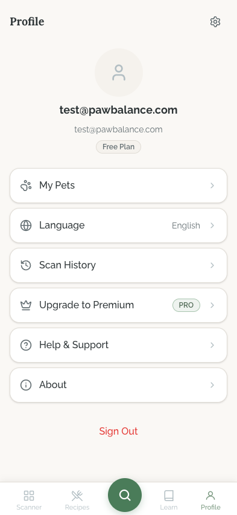
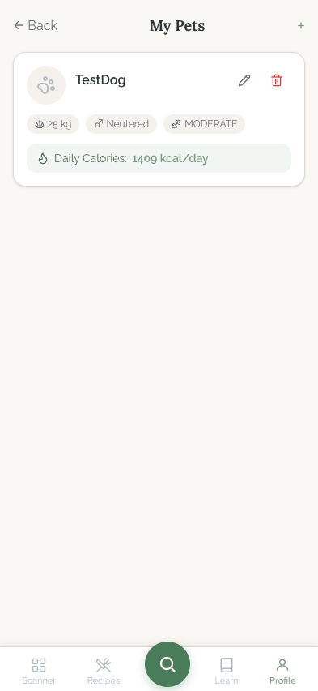
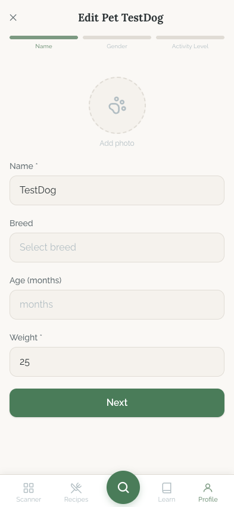
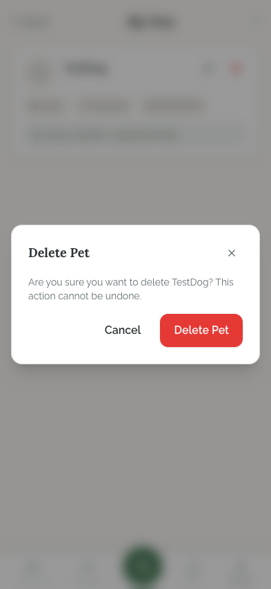
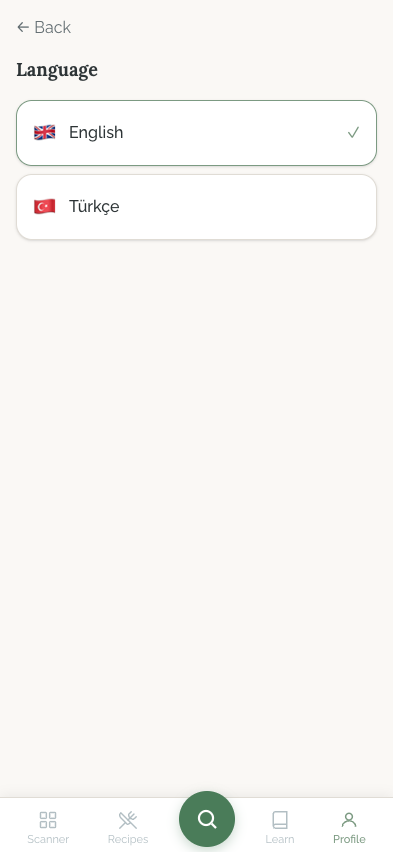
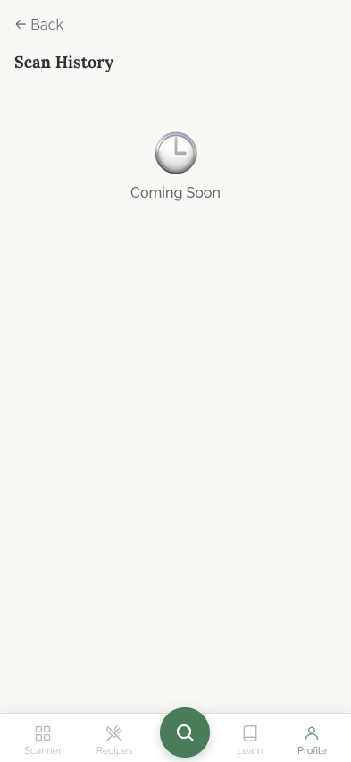

# Profile Flow

## Flow Overview

The Profile flow is the user's account hub, accessible from the rightmost tab ("Profile") in the bottom navigation bar. It serves as the central settings area where users manage their account, pets, language preference, and access secondary features like scan history and premium upgrades. The flow follows a hub-and-spoke pattern: the main profile screen lists all options, and each option navigates to a dedicated sub-screen.

**Entry point:** Bottom navigation bar, Profile tab (person icon).

**Sub-screens:** My Pets (list, edit, delete), Language, Scan History, Upgrade to Premium, Help & Support, About.

---

## Screens

### Profile Main

**Purpose:** Account hub and settings menu. This is the landing screen for the Profile tab.

**Key Elements:**
- **User avatar placeholder** -- circular sage-green-tinted avatar area at the top center, currently showing a generic person icon (no uploaded photo).
- **User email** -- displayed as the primary identifier in bold ("test@pawbalance.com"), with a secondary lighter email line below.
- **Plan badge** -- a small outlined pill badge reading "Free Plan" below the email, indicating the user's subscription tier.
- **Settings gear icon** -- top-right corner, presumably for additional account settings.
- **Menu list** -- six vertically stacked card-style rows, each with a left icon, label text, and a right chevron:
  1. **My Pets** -- paw icon
  2. **Language** -- globe icon, with the current value ("English") shown inline
  3. **Scan History** -- clock/history icon
  4. **Upgrade to Premium** -- crown icon with a green "PRO" badge
  5. **Help & Support** -- question-circle icon
  6. **About** -- info-circle icon
- **Sign Out** -- red text link at the bottom of the menu list, no icon.
- **Bottom navigation bar** -- persistent across the app, with Profile tab highlighted.

**Interactions:**
- Tap any menu row to navigate to its sub-screen.
- Tap "Sign Out" to log out and return to the welcome/login screen.
- Tap the gear icon for additional settings (not captured in screenshots).

**Transitions:**
- My Pets -> Pets List screen
- Language -> Language Selector screen
- Scan History -> Scan History screen
- Upgrade to Premium -> Premium paywall (not captured)
- Help & Support -> Help screen (not captured)
- About -> About screen (not captured)

---

### Pets List

**Purpose:** Display all pets belonging to the authenticated user, with quick access to edit or delete each pet.

**Key Elements:**
- **Header** -- centered title "My Pets" with a back arrow on the left and a "+" add button on the right.
- **Pet card** -- a single card for "TestDog" containing:
  - **Pet avatar** -- circular placeholder with a paw icon (no uploaded photo).
  - **Pet name** -- "TestDog" in bold.
  - **Action icons** -- an edit (pencil) icon and a delete (trash, red) icon in the top-right of the card.
  - **Attribute chips** -- small outlined pills showing "25 kg", male gender icon + "Neutered", paw icon + "MODERATE" (activity level).
  - **Daily calories banner** -- a subtle sage-green background strip at the bottom of the card showing a fire/calorie icon and "Daily Calories: 1409 kcal/day".
- **Empty space** -- the rest of the screen is empty, indicating only one pet exists.

**Interactions:**
- Tap "+" to create a new pet (navigates to the pet creation wizard / onboarding flow).
- Tap the pencil icon to edit the pet (navigates to Pet Edit screen).
- Tap the red trash icon to trigger the delete confirmation dialog.

**Transitions:**
- "+" button -> Pet creation wizard (onboarding flow)
- Pencil icon -> Pet Edit screen (for the selected pet)
- Trash icon -> Pet Delete Dialog (modal overlay)
- Back arrow -> Profile Main

---

### Pet Edit

**Purpose:** Multi-step wizard for editing an existing pet's details. The screenshot shows Step 1 of 3.

**Key Elements:**
- **Header** -- "Edit Pet TestDog" centered, with an "X" close button on the left.
- **Step indicator** -- three horizontal progress segments at the top, labeled "Name", "Gender", and "Activity Level". The first segment ("Name") is highlighted in sage green, indicating the current step.
- **Photo upload** -- circular placeholder with a paw icon and "Add photo" text below. Tapping opens the camera/photo picker.
- **Form fields (Step 1 -- Name):**
  - **Name** (required, marked with asterisk) -- text input, pre-filled with "TestDog".
  - **Breed** -- text input with "Select breed" placeholder, currently empty.
  - **Age (months)** -- numeric input with "months" placeholder, currently empty.
  - **Weight** (required, marked with asterisk) -- numeric input, pre-filled with "25".
- **Next button** -- full-width sage-green button at the bottom to advance to Step 2 (Gender).

**Interactions:**
- Edit any field and tap "Next" to proceed to the Gender step.
- Tap the photo area to upload or change the pet's photo.
- Tap "X" to discard changes and return to the Pets List.

**Transitions:**
- Next -> Step 2 (Gender selection)
- X -> Pets List (discard changes)

---

### Pet Delete Dialog

**Purpose:** Confirmation modal for the destructive action of permanently deleting a pet.

**Key Elements:**
- **Backdrop** -- the Pets List screen is dimmed/blurred behind the modal.
- **Dialog card** -- centered white card with rounded corners containing:
  - **Title** -- "Delete Pet" in bold.
  - **Close button** -- "X" in the top-right corner of the dialog.
  - **Warning message** -- "Are you sure you want to delete TestDog? This action cannot be undone." -- clearly communicates the irreversibility.
  - **Action buttons** -- two buttons side by side:
    - **Cancel** -- plain text button on the left (non-destructive).
    - **Delete Pet** -- red filled button on the right (destructive action, visually prominent).

**Interactions:**
- Tap "Cancel" or "X" to dismiss the dialog and return to the Pets List.
- Tap "Delete Pet" to permanently delete the pet and return to the Pets List (pet removed).

**Transitions:**
- Cancel / X -> Pets List (unchanged)
- Delete Pet -> Pets List (pet removed, potential empty state)

---

### Language Selector

**Purpose:** Allow the user to switch the app's display language between English and Turkish.

**Key Elements:**
- **Header** -- "Back" arrow on the left, "Language" as a bold left-aligned title below.
- **Language options** -- two card-style rows:
  - **English** -- UK flag emoji, "English" label, with a sage-green checkmark on the right indicating it is the currently selected language.
  - **Turkce** -- Turkish flag emoji, "Turkce" label, no checkmark (not selected).

**Interactions:**
- Tap a language row to switch the app language. The selection takes effect immediately (the entire UI re-renders in the chosen language).
- Tap "Back" to return to Profile Main.

**Transitions:**
- Back -> Profile Main

---

### Scan History

**Purpose:** Placeholder screen for the upcoming scan history feature (not yet implemented).

**Key Elements:**
- **Header** -- "Back" arrow on the left, "Scan History" as a bold left-aligned title below.
- **Empty state** -- centered clock emoji icon and "Coming Soon" text, indicating the feature is under development.

**Interactions:**
- Tap "Back" to return to Profile Main.
- No other interactions available.

**Transitions:**
- Back -> Profile Main

---

## State Variations

| State | Screen | Description |
|-------|--------|-------------|
| **Empty pet list** | Pets List | When user has no pets, the list would show an empty state (potentially prompting to add a pet). |
| **Multiple pets** | Pets List | Cards stack vertically; the list scrolls. |
| **Loading pets** | Pets List | Skeleton or loading spinner while fetching pets from Supabase. |
| **Delete in progress** | Pet Delete Dialog | The "Delete Pet" button should show a loading state while the API call completes. |
| **Save in progress** | Pet Edit | The "Next" / final save button shows a loading state during submission. |
| **Form validation error** | Pet Edit | Required fields (Name, Weight) show red border and error message if submitted empty. |
| **Photo uploading** | Pet Edit | Progress indicator on the photo circle while the image uploads to Supabase storage. |
| **Language switching** | Language Selector | Brief loading/transition while the locale changes and the UI re-renders. |
| **Free vs Premium** | Profile Main | The plan badge changes from "Free Plan" to "Premium" for subscribed users; "Upgrade to Premium" row may hide. |

---

## UI/UX Improvement Suggestions

### Critical

- **Touch target size on pet card action icons.** The pencil (edit) and trash (delete) icons on the pet card appear to be small icon buttons without sufficient padding. Per mobile UX guidelines, interactive elements must be at least 44x44px. These icons risk mis-taps, especially since the delete icon triggers a destructive action. **Fix:** Increase the tap area of both icons to at least 44x44px, or replace them with more explicit text buttons (e.g., "Edit" / "Delete" labels).

- **No visible focus states on menu items.** The profile menu rows (My Pets, Language, etc.) lack visible focus indicators for keyboard and assistive technology navigation. **Fix:** Add `:focus-visible` ring styles to each interactive row.

### High

- **Sign Out button lacks safeguards.** The red "Sign Out" text link at the bottom of the profile menu has no confirmation step. A user could accidentally tap it and lose their session. **Fix:** Add a confirmation dialog ("Are you sure you want to sign out?") before executing sign-out, consistent with the delete pet confirmation pattern.

- **Empty breed and age fields on pet edit.** The edit form for "TestDog" shows Breed and Age as empty, even though this is an existing pet being edited. If these fields were never filled, the form should guide the user to complete them (e.g., a subtle prompt or visual indicator that the profile is incomplete). If they were filled but not loading, this is a data-fetch bug. **Fix:** Investigate whether these fields are populated in the database and ensure they load. If optional, consider showing a "Complete your pet's profile" nudge.

- **Scan History placeholder uses emoji icon.** The "Coming Soon" state uses what appears to be an emoji clock icon rather than a proper SVG icon. Per the project's design system, SVG icons (Lucide) should be used consistently -- not emojis. **Fix:** Replace the emoji with a Lucide clock or calendar SVG icon and style it in the app's muted text color.

- **Profile avatar is not interactive/editable.** The user avatar on the Profile Main screen appears to be a static placeholder with no indication that it can be tapped to upload a photo. **Fix:** Add a small camera/edit overlay badge on the avatar circle to signal interactivity, or add an "Edit Profile" row to the menu.

### Medium

- **No visual grouping of menu items.** All six menu rows (My Pets through About) are visually identical and evenly spaced with no grouping. This makes it harder to scan. **Fix:** Group related items into sections -- e.g., "Account" (My Pets, Language), "App" (Scan History, Upgrade), "Info" (Help & Support, About) -- with subtle section headers or increased spacing between groups.

- **Language selector has no page title in the header bar.** The Language screen uses "Back" text with an arrow but places the "Language" title as a separate bold heading below, unlike the "My Pets" screen which uses a centered title in the header bar. This inconsistency breaks the navigation pattern. **Fix:** Standardize all sub-screens to use either the centered-title-in-header pattern (like My Pets) or the left-aligned-title-below pattern (like Language/Scan History), not both.

- **Delete dialog button alignment.** In the delete confirmation dialog, the "Cancel" text button and the "Delete Pet" filled button have inconsistent visual weight. The Cancel button is plain text while Delete Pet is a fully filled red button. While this correctly draws attention to the destructive action, the Cancel option could benefit from being a bordered/outlined button rather than plain text to make it a more obvious tap target. **Fix:** Give the Cancel button an outlined style with sufficient padding to ensure it meets the 44px touch target minimum.

- **Pet card daily calories banner lacks context.** The "Daily Calories: 1409 kcal/day" strip at the bottom of the pet card is useful but provides no context on how it was calculated or what factors it considers. **Fix:** Add an info tooltip or a small "(i)" icon that explains the calculation basis (weight, activity level, age, neutered status).

- **No pull-to-refresh on Pets List.** The pets list screen does not appear to have pull-to-refresh functionality, which is an expected pattern on mobile list screens. **Fix:** Implement pull-to-refresh to re-fetch the pet list from Supabase, with `overscroll-behavior: contain` on screens where it is not desired.

- **Step indicator labels on pet edit are not tappable.** The three-step indicator ("Name", "Gender", "Activity Level") at the top of the pet edit wizard appears to be display-only. Allowing users to tap a step to jump to it (for completed steps) would improve navigation in the wizard. **Fix:** Make completed steps tappable, with the current step and future steps remaining non-interactive.
