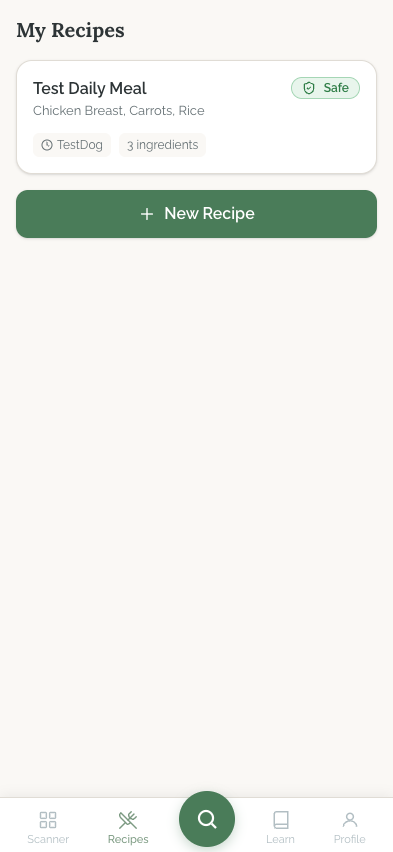
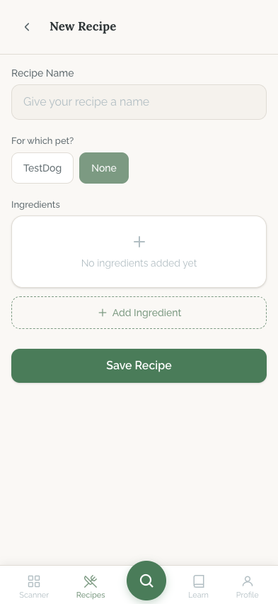
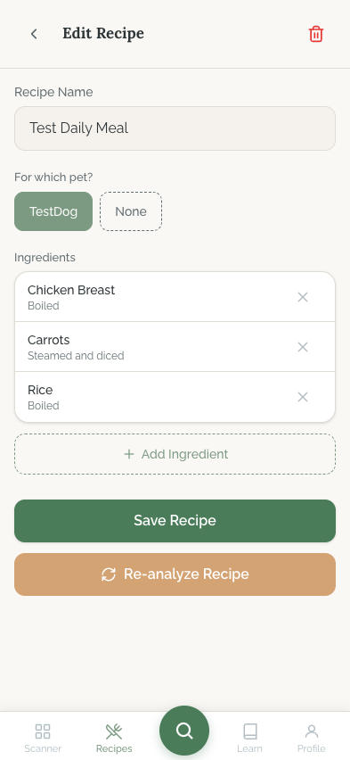
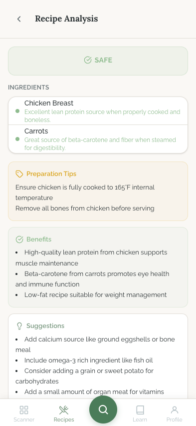

# Recipes Flow

## Flow Overview

The Recipes flow lets users create, edit, and analyze homemade dog food recipes. It is accessible via the "Recipes" tab (second from left) in the bottom navigation. Users build recipes by naming them, assigning them to a pet, and adding ingredients with preparation methods. Once saved, recipes can be sent for AI-powered nutritional analysis that evaluates safety, preparation tips, benefits, and suggestions.

**Entry points:**
- Tapping the Recipes icon in the bottom navigation
- Deep link to a specific recipe via query params

**Core user journey:** Recipe List --> New/Edit Recipe --> Save --> AI Analysis

---

## Screens

### Recipe List

**Purpose:** Overview of all the user's saved recipes. Serves as the entry point to create new recipes or manage existing ones.

**Key Elements:**
- **Page title** -- "My Recipes" (left-aligned, bold heading)
- **Recipe cards** -- each card displays:
  - Recipe name ("Test Daily Meal") in bold
  - Safety badge in the top-right corner ("Safe" with green background and checkmark icon) -- reflects the latest analysis result
  - Ingredient summary as a comma-separated list ("Chicken Breast, Carrots, Rice")
  - Metadata pills at the bottom: pet name with clock icon ("TestDog") and ingredient count ("3 ingredients")
- **New Recipe button** -- full-width sage green filled button with "+" icon and "New Recipe" label, positioned below the recipe cards
- **Bottom navigation** -- persistent, with Recipes tab active/highlighted

**Interactions:**
- Tap a recipe card to navigate to Edit Recipe
- Tap "+ New Recipe" to navigate to New Recipe form
- Scroll to see additional recipes (if more than fit on screen)

**Transitions:**
- Recipe card tap --> Edit Recipe screen (with recipe data pre-filled)
- New Recipe button --> New Recipe screen (empty form)

---

### New Recipe

**Purpose:** Form for creating a new recipe from scratch. Provides fields for recipe name, pet assignment, and ingredient management.

**Key Elements:**
- **Header** -- back arrow (left) and title "New Recipe" (centered)
- **Recipe Name field** -- labeled text input with placeholder "Give your recipe a name"
- **Pet selector** -- "For which pet?" label with horizontally scrollable pill/chip buttons listing the user's pets ("TestDog") plus a "None" option. "None" is currently selected (filled sage green style)
- **Ingredients section** -- "Ingredients" label with:
  - Empty state placeholder: a "+" icon above "No ingredients added yet" text inside a dashed-border container
  - "+ Add Ingredient" button below (dashed-border outline style, sage green text)
- **Save Recipe button** -- full-width sage green filled button at the bottom
- **Bottom navigation** -- persistent

**Interactions:**
- Type a recipe name
- Tap a pet pill to assign the recipe to that pet (or "None" for unassigned)
- Tap "+ Add Ingredient" to add an ingredient (likely opens an inline form or dialog for ingredient name and preparation method)
- Tap "Save Recipe" to validate and save
- Tap the back arrow to discard and return to Recipe List

**Transitions:**
- Save --> Recipe List (with new recipe added) or Edit Recipe (for the newly created recipe)
- Back arrow --> Recipe List

---

### Edit Recipe

**Purpose:** Modify an existing recipe -- rename, change pet assignment, add/remove ingredients, and trigger re-analysis.

**Key Elements:**
- **Header** -- back arrow (left), title "Edit Recipe" (centered), and a red trash/delete icon (top-right)
- **Recipe Name field** -- pre-filled text input ("Test Daily Meal")
- **Pet selector** -- "For which pet?" label with pet pills. "TestDog" is selected (filled sage green), "None" is unselected (outline style)
- **Ingredients list** -- "Ingredients" label with existing ingredients displayed as rows:
  - Each row shows ingredient name (bold) and preparation method (gray subtitle), with an X/remove button on the right
  - Visible ingredients: "Chicken Breast" (Boiled), "Carrots" (Steamed and diced), "Rice" (Boiled)
- **+ Add Ingredient button** -- dashed-border outline button below the ingredients list
- **Save Recipe button** -- full-width sage green filled button
- **Re-analyze Recipe button** -- full-width amber/gold outlined button with a refresh icon, positioned below Save. This triggers a new AI analysis for the updated recipe
- **Bottom navigation** -- persistent

**Interactions:**
- Edit the recipe name inline
- Tap a different pet pill to reassign
- Tap the X on any ingredient to remove it
- Tap "+ Add Ingredient" to add a new ingredient
- Tap "Save Recipe" to persist changes
- Tap "Re-analyze Recipe" to send the updated recipe for AI analysis
- Tap the trash icon to delete the recipe (likely with a confirmation dialog)
- Tap back arrow to return to Recipe List

**Transitions:**
- Save --> stays on Edit Recipe (or navigates to Recipe List with updated data)
- Re-analyze --> Recipe Analysis screen (streaming results)
- Delete --> confirmation dialog --> Recipe List
- Back arrow --> Recipe List

---

### Recipe Analysis

**Purpose:** Displays the AI-generated nutritional analysis of a recipe, including safety assessment, ingredient breakdowns, preparation guidance, benefits, and improvement suggestions.

**Key Elements:**
- **Header** -- back arrow (left) and title "Recipe Analysis" (centered)
- **Overall safety badge** -- large "SAFE" badge with green background and checkmark icon, centered at the top
- **Ingredients section** -- "INGREDIENTS" heading with individual ingredient analysis cards:
  - Each ingredient card has a colored bullet (green for safe) and the ingredient name in bold
  - Below each name: a brief analysis note (e.g., "Chicken Breast" -- "Excellent lean protein source when properly cooked and boneless"; "Carrots" -- "Great source of beta-carotene and fiber when steamed for digestibility")
- **Preparation Tips section** -- amber/gold card with cooking icon:
  - Bullet points of specific preparation instructions (e.g., "Ensure chicken is fully cooked to 165F internal temperature", "Remove all bones from chicken before serving")
- **Benefits section** -- green card with checkmark icon:
  - Bullet list of nutritional benefits (e.g., "High-quality lean protein from chicken supports muscle maintenance", "Beta-carotene from carrots promotes eye health and immune function", "Low-fat recipe suitable for weight management")
- **Suggestions section** -- neutral/gray card:
  - Bullet list of improvement suggestions (e.g., "Add calcium source like ground eggshells or bone meal", "Consider omega-3 rich ingredient like fish oil", "Consider adding a grain or sweet potato for carbohydrates", "Add a small amount of organ meat for vitamins")
- **Bottom navigation** -- persistent

**Interactions:**
- Scroll to read the full analysis report
- Tap the back arrow to return to Edit Recipe
- (Potentially) tap on ingredient names for more detail or to navigate to Food Detail

**Transitions:**
- Back arrow --> Edit Recipe screen

---

## State Variations

| State | Behavior |
|-------|----------|
| **Empty recipe list** | Likely shows an empty state message with a prompt to create the first recipe (not captured in screenshots) |
| **Loading (list)** | Recipe cards likely show skeleton placeholders during fetch |
| **Loading (analysis)** | Analysis screen uses SSE streaming -- likely shows a progress indicator or skeleton while the AI generates the report incrementally |
| **Analysis in progress** | The analysis report builds incrementally as the AI streams results (SSE); sections appear one by one |
| **Analysis failed** | Not captured -- likely shows an error message with a "Retry" option |
| **No pet selected** | "None" pill is selected; analysis may not be available without a pet assigned |
| **Recipe with no ingredients** | Shows the "No ingredients added yet" empty state; Save may be disabled or show a validation error |

---

## UI/UX Improvement Suggestions

### Critical

- **No confirmation or undo when deleting an ingredient.** Tapping the X button on an ingredient row appears to remove it immediately with no confirmation. A single accidental tap could delete an ingredient, forcing the user to re-add it. Add either a swipe-to-delete gesture with a visible "Delete" action, or show a brief undo toast ("Ingredient removed. Undo") after deletion.

- **Recipe analysis has no way to act on suggestions.** The Suggestions section lists actionable improvements (e.g., "Add calcium source like ground eggshells or bone meal") but provides no mechanism to act on them. Each suggestion should include a tappable action -- such as an "Add" button that pre-fills the ingredient name -- to reduce friction between reading a suggestion and implementing it.

### High

- **Ingredient addition flow is unclear.** The "+ Add Ingredient" button's destination is not shown in the screenshots, but the current edit view suggests it may be a simple text input. A more guided approach would improve the experience: show a search-within-database field that matches against the food database (leveraging the existing `search_foods` RPC), so users can select known-safe ingredients. Free-text entry should remain as a fallback.

- **No visual differentiation between New and Edit forms.** The New Recipe and Edit Recipe screens are structurally identical except for the title and the presence of the delete/re-analyze buttons. The Edit screen should surface the last analysis date and result prominently (e.g., "Last analyzed: 2 days ago -- Safe") so users know whether re-analysis is needed after changes.

- **Recipe card does not indicate analysis age or staleness.** The recipe list card shows a "Safe" badge but does not indicate when the analysis was performed. If a user edits ingredients after analysis, the badge may be stale. Add a visual indicator (e.g., a small "outdated" warning icon or a timestamp like "Analyzed 3d ago") when the recipe has been modified since the last analysis.

### Medium

- **Pet selector does not indicate why pet assignment matters.** The "For which pet?" section offers pills but does not explain that the AI analysis is personalized to the selected pet's breed, age, and health profile. A brief helper text like "Analysis will be tailored to your pet's profile" below the label would set expectations.

- **Analysis screen lacks a share or export action.** Users may want to share the analysis report with a veterinarian or family member. Adding a "Share" button in the header or at the bottom of the report (generating a text summary or screenshot) would add utility.

- **Ingredient preparation method is easy to miss.** In the edit view, the preparation method ("Boiled", "Steamed and diced") appears as small gray subtitle text below the ingredient name. This information is important for the AI analysis. Consider making it more visually distinct -- e.g., a separate "Preparation" chip or tag next to the ingredient name.

- **No drag-to-reorder for ingredients.** Ingredients are listed in a fixed order with no apparent way to rearrange them. Adding drag handles for reordering (leveraging the existing `sort_order` column in `recipe_ingredients`) would let users organize ingredients by importance or proportion.

- **Analysis sections use inconsistent visual hierarchy.** The Ingredients section uses inline text under each ingredient, while Preparation Tips, Benefits, and Suggestions use card containers with icons. Wrapping the Ingredients section in a similar card with a header icon would create visual consistency across all sections.

- **Empty recipe list state not shown.** If a user has no recipes, the list screen should show an engaging empty state with an illustration and a clear call-to-action (e.g., "Create your first recipe to get AI-powered nutritional analysis"), not just the "+ New Recipe" button on a blank page.
