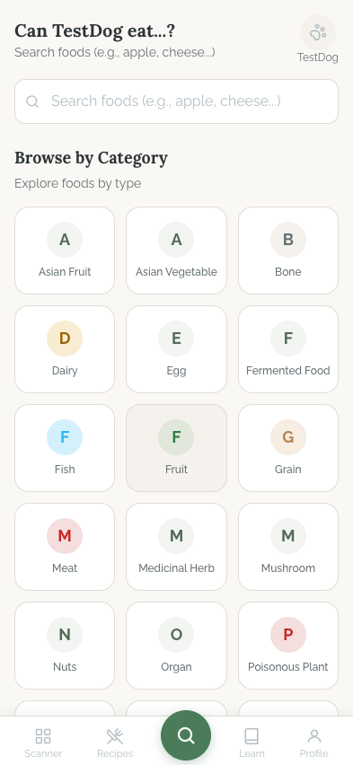
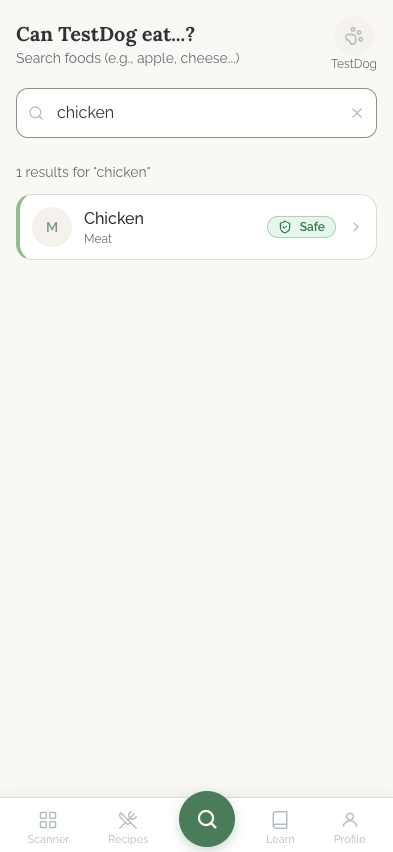
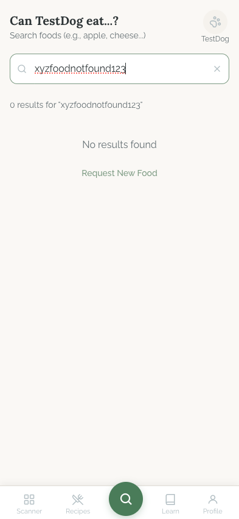
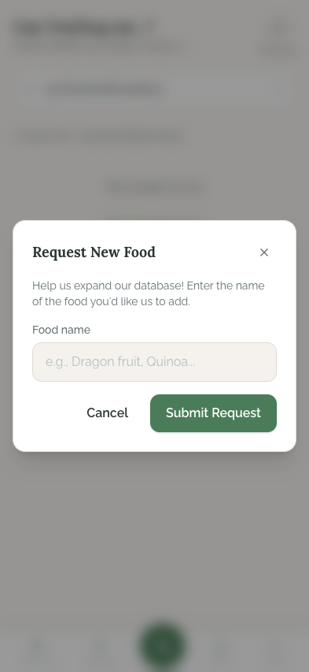
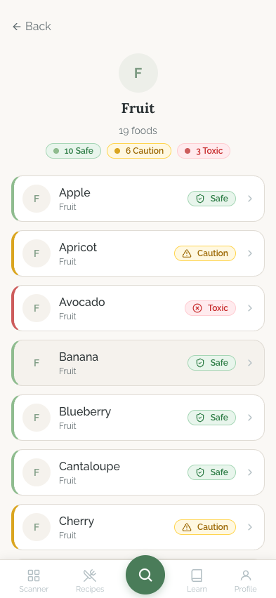
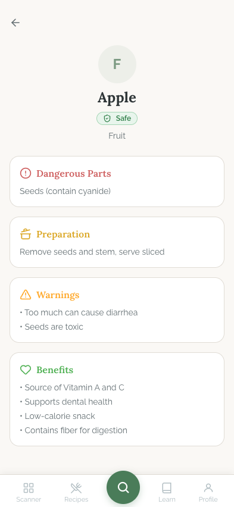

# Search Flow

## Flow Overview

The Search flow is the **main/home tab** of PawBalance, accessible via the center (highlighted) button in the bottom navigation bar. Its primary purpose is to answer the question "Can my dog eat this?" by letting users search for foods, browse by category, and view detailed safety information for each food item.

**Entry points:**
- App launch (default tab)
- Tapping the center Search icon in the bottom navigation
- Deep link to a specific food or category (via query params)

**Core user journey:** Home (categories) --> Search / Browse --> Food Detail

---

## Screens

### Home / Categories

**Purpose:** Landing screen for the Search tab. Provides two entry paths -- a search bar for direct lookup and a category grid for exploratory browsing.

**Key Elements:**
- **Header** -- personalized title "Can TestDog eat...?" with subtitle "Search foods (e.g., apple, cheese...)" and a pet avatar button (top-right) showing the selected pet's name ("TestDog") with a settings/gear icon
- **Search bar** -- full-width input with a magnifying glass icon and placeholder text "Search foods (e.g., apple, cheese...)"
- **Section heading** -- "Browse by Category" with subtitle "Explore foods by type"
- **Category grid** -- 3-column grid of category cards, each containing a circular icon with the category's first letter (color-coded) and the category name below. Visible categories include: Asian Fruit, Asian Vegetable, Bone, Dairy, Egg, Fermented Food, Fish, Fruit, Grain, Meat, Medicinal Herb, Mushroom, Nuts, Organ, Poisonous Plant (partially visible, list scrolls)
- **Bottom navigation** -- 5 tabs: Scanner, Recipes, Search (center, elevated green circle), Learn, Profile

**Interactions:**
- Tap the search bar to focus and type a food name
- Tap any category card to navigate to the Category Browse screen
- Tap the pet avatar/name button to access pet settings or switch pets
- Tap any bottom nav tab to switch sections

**Transitions:**
- Search input with text --> Search Results screen
- Category card tap --> Category Browse screen
- Pet avatar tap --> Profile/pet selection

---

### Search Results

**Purpose:** Displays matching foods based on the user's search query with their safety classification.

**Key Elements:**
- **Header** -- same personalized "Can TestDog eat...?" header with pet avatar
- **Search bar** -- shows the active query ("chicken") with a clear (X) button
- **Result count** -- "1 results for 'chicken'" displayed below the search bar
- **Result cards** -- list of food items, each card showing:
  - Circular letter icon (category initial, e.g., "M" for Meat)
  - Food name ("Chicken") and category label ("Meat")
  - Safety badge on the right ("Safe" with green background and checkmark icon)
  - Chevron arrow indicating tappable/navigable
- **Bottom navigation** -- persistent at bottom

**Interactions:**
- Tap a result card to navigate to Food Detail
- Tap the X button to clear the search query
- Continue typing to refine results (search appears to be real-time/debounced)

**Transitions:**
- Result card tap --> Food Detail screen
- Clear search --> returns to Home / Categories

---

### No Results

**Purpose:** Handles the dead-end case when no foods match the search query, and provides a recovery path via food request.

**Key Elements:**
- **Header** -- same personalized header
- **Search bar** -- shows the query ("xyzfoodnotfound123") with clear button
- **Result count** -- "0 results for 'xyzfoodnotfound123'"
- **Empty state message** -- centered "No results found" text
- **Recovery action** -- "Request New Food" link (sage green text, tappable)
- **Bottom navigation** -- persistent

**Interactions:**
- Tap "Request New Food" to open the Food Request Dialog
- Tap X to clear search and return to categories
- Edit the search query to try a different term

**Transitions:**
- "Request New Food" tap --> Food Request Dialog (modal overlay)

---

### Food Request Dialog

**Purpose:** Modal dialog allowing users to submit a request to add a new food to the database. Appears as an overlay on top of the blurred/dimmed search screen.

**Key Elements:**
- **Dialog card** -- white rounded card with:
  - Title "Request New Food" with close (X) button
  - Description text: "Help us expand our database! Enter the name of the food you'd like us to add."
  - "Food name" label with text input (placeholder: "e.g., Dragon fruit, Quinoa...")
  - Two action buttons: "Cancel" (text/outline style) and "Submit Request" (filled sage green primary button)
- **Backdrop** -- blurred/dimmed overlay behind the dialog

**Interactions:**
- Type a food name into the input field
- Tap "Submit Request" to send the request
- Tap "Cancel" or the X button to dismiss the dialog
- Tap outside the dialog (on the backdrop) to dismiss

**Transitions:**
- Submit --> closes dialog, returns to search results (presumably with a success toast/confirmation)
- Cancel/X/backdrop tap --> closes dialog, returns to previous state

---

### Category Browse

**Purpose:** Lists all foods within a selected category, showing the safety level of each food at a glance. Enables quick scanning of which foods are safe, require caution, or are toxic.

**Key Elements:**
- **Back button** -- top-left "Back" text with arrow
- **Category header** -- centered circular icon with category letter ("F"), category name ("Fruit"), food count ("19 foods")
- **Safety summary pills** -- three horizontal pills showing counts: "10 Safe" (green dot), "6 Caution" (amber dot), "3 Toxic" (red dot)
- **Food list** -- scrollable list of food cards, each with:
  - Left border color-coded by safety level (green for Safe, amber for Caution, red for Toxic)
  - Circular letter icon
  - Food name and category label
  - Safety badge (Safe/Caution/Toxic with corresponding color and icon)
  - Chevron arrow for navigation
- **Visible foods:** Apple (Safe), Apricot (Caution), Avocado (Toxic), Banana (Safe), Blueberry (Safe), Cantaloupe (Safe), Cherry (Caution) -- list continues by scrolling
- **Bottom navigation** -- persistent

**Interactions:**
- Tap any food card to navigate to Food Detail
- Tap "Back" to return to Home / Categories
- Scroll to see all foods in the category

**Transitions:**
- Food card tap --> Food Detail screen
- Back button --> Home / Categories

---

### Food Detail

**Purpose:** Comprehensive safety information screen for a single food item. Provides all the details a dog owner needs to make a feeding decision.

**Key Elements:**
- **Back button** -- top-left arrow icon
- **Food header** -- circular icon with category letter ("F"), food name ("Apple"), safety badge ("Safe" in green), category label ("Fruit")
- **Information cards** -- four distinct content sections, each in its own card with a colored left accent/header:
  1. **Dangerous Parts** (red/warning accent, exclamation icon) -- "Seeds (contain cyanide)"
  2. **Preparation** (amber/caution accent, cooking icon) -- "Remove seeds and stem, serve sliced"
  3. **Warnings** (amber accent, triangle icon) -- bullet list: "Too much can cause diarrhea", "Seeds are toxic"
  4. **Benefits** (green accent, heart icon) -- bullet list: "Source of Vitamin A and C", "Supports dental health", "Low-calorie snack", "Contains fiber for digestion"
- **Bottom navigation** -- persistent

**Interactions:**
- Tap back arrow to return to previous screen (search results or category browse)
- Scroll to read all sections

**Transitions:**
- Back arrow --> previous screen (Category Browse or Search Results, depending on navigation path)

---

## State Variations

| State | Behavior |
|-------|----------|
| **Loading (search)** | Likely shows a loading indicator or skeleton while fetching results (not captured in screenshots) |
| **Loading (categories)** | Category grid likely shows skeleton placeholders during initial fetch |
| **Empty search** | Search bar with no input shows the Home / Categories screen |
| **Results found** | Displays result count and list of matching food cards |
| **No results** | Shows "No results found" message with "Request New Food" recovery action |
| **Error state** | Not captured -- likely shows a generic error message with retry option |
| **No pet selected** | Header would show generic text instead of pet name |

---

## UI/UX Improvement Suggestions

### Critical

- **Category icons use plain letter initials instead of meaningful icons.** Every category card shows just the first letter of the category name (e.g., "A" for Asian Fruit, "F" for Fish) inside a circle. This provides almost no visual differentiation -- several categories share the same letter (M appears for Meat, Medicinal Herb, and Mushroom; F appears for Fermented Food, Fish, and Fruit). Replace these with distinct food/category SVG icons (e.g., a fish icon for Fish, a wheat icon for Grain, a mushroom icon for Mushroom) to enable faster visual scanning and recognition.

- **Search lacks autocomplete/suggestions.** The search requires the user to type and submit with no predictive assistance. Adding debounced autocomplete suggestions as the user types (showing top 3-5 matches in a dropdown below the input) would significantly reduce time-to-result and help users discover foods they may not know the exact spelling of.

### High

- **No results empty state is too sparse.** The "No results found" message with a single "Request New Food" link does not help the user recover. Improve this by: (1) adding an illustrative icon or illustration above the message, (2) suggesting similar/related search terms using the existing `get_similar_foods` RPC, and (3) making the "Request New Food" action a visible button rather than a plain text link.

- **Category card left-border safety color coding is subtle.** On the Category Browse screen, the left-border color indicating safety level (green/amber/red) is quite thin and easy to miss. Consider making the safety indication more prominent -- for example, using a light background tint on the entire card row matching the safety level, or increasing the left border width.

- **Food Detail lacks a "share" or "save" action.** Users who look up food safety information may want to quickly share it with a family member or vet. Adding a share button in the Food Detail header would improve utility.

### Medium

- **Category grid letter-circles use inconsistent colors with no legend.** The circular icons use different colors (green, gray, red for Poisonous Plant) but there is no consistent system -- some safe categories like Fruit use green while others like Grain use amber. If the color is meant to convey meaning (e.g., general category safety tendency), add a legend. If not, standardize to a single neutral color or use category-specific icons instead.

- **Search result count has a grammar issue.** The text shows "1 results for 'chicken'" -- this should read "1 result" (singular) when the count is 1.

- **Food Request Dialog input lacks validation feedback.** The dialog does not visually indicate whether the input is valid before enabling "Submit Request." Consider disabling the submit button when the input is empty and showing inline validation for minimum length.

- **Food Detail does not show pet-specific context.** The header mentions the selected pet ("TestDog") on the home screen, but the Food Detail screen does not personalize the information. Consider adding a note like "For TestDog (Golden Retriever, 3 years)" to contextualize warnings or benefits based on the pet's breed, age, or health conditions.

- **Category Browse has no search/filter within the category.** With 19 foods in Fruit alone, scrolling through the entire list can be tedious. Adding a small search/filter bar at the top of the category list (or sticky safety-level filter pills) would help users quickly find a specific food within a large category.

- **Bottom navigation Search button lacks a label.** The center elevated green circle does not have the word "Search" below it like the other tabs. While the elevated treatment implies importance, adding the label improves clarity for first-time users.
