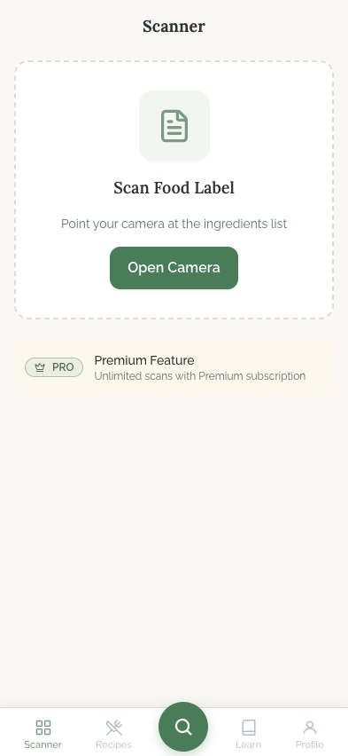
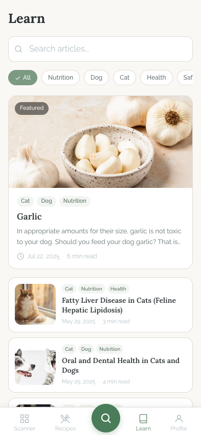

# Tabs Overview

## Flow Overview

PawBalance uses a fixed bottom navigation bar with five tabs: Scanner, Recipes, Search (center/home), Learn, and Profile. The center Search tab is visually elevated as a floating circular button with the sage green primary color, distinguishing it as the home/default destination. All other tabs show an icon above a text label with a tertiary gray color when inactive and the primary sage green when active. The bottom nav is fixed to the viewport bottom and respects safe-area insets for devices with home indicators.

## Screens

### Scan Tab

**Purpose:** Placeholder screen for the food label scanner feature, which is gated behind a premium (PRO) subscription. The scanner is not yet functional -- this screen communicates the feature's existence and its premium status.

**Key Elements:**
- **Page title:** "Scanner" at the top, bold, centered.
- **Dashed card:** A large centered card with a dashed border and white surface background containing:
  - A rounded sage-green icon container (document/scanner icon at 80x80px).
  - Heading: "Scan Food Label" in semibold text.
  - Subtitle: "Point your camera at the ingredients list" in secondary gray text.
  - Primary CTA button: "Open Camera" in the standard sage green button style (though functionally disabled via `aria-disabled="true"`).
- **Premium banner:** Below the card, a warm caution-tinted row with:
  - A "PRO" badge (crown icon + text) in the premium variant style.
  - "Premium Feature" label in medium weight.
  - "Unlimited scans with Premium subscription" in secondary text.
- **Bottom nav:** All five tabs visible; Scanner tab is highlighted (active state in sage green).

**Interactions:**
- The "Open Camera" button is visually styled as active but is functionally disabled (`aria-disabled="true"`, onClick is a no-op). Tapping it does nothing.
- No other interactive elements on the page besides the bottom navigation tabs.

**Transitions:**
- Tapping any other bottom nav tab navigates to that tab's screen.
- There is no transition away from this screen via the main content area -- it is a dead-end placeholder.

### Learn Tab

**Purpose:** Knowledge base / article hub where users browse dog nutrition, health, and safety articles. Serves as the entry point to the blog/article reading experience.

**Key Elements:**
- **Page title:** "Learn" at top-left, large (26px) bold heading using the heading font.
- **Search bar:** Full-width text input with a search icon on the left, placeholder text "Search articles...", rounded-input border radius (12px), focus ring transitions to primary green.
- **Tag filter chips:** Horizontally scrollable row of category chips (All, Nutrition, Dog, Health, Safety, Behavior, Diet). Active chip is filled sage green with white text and a check icon; inactive chips are outlined with secondary text. The row hides scrollbars for a clean look.
- **Featured article card:** A prominent card with:
  - Full-width featured image (180px tall) with a dark semi-transparent "Featured" badge overlay at top-left.
  - Below the image: tag pills (e.g., "Nutrition"), article title in semibold heading font, two-line excerpt in secondary text, and a meta line with clock icon, date, and reading time.
- **Regular article rows:** Compact list items with:
  - 80x80px square thumbnail on the left (rounded-xl corners).
  - Tags, title (two-line clamp), and date/reading-time meta on the right.
- **Bottom nav:** Learn tab highlighted in active state.

**Interactions:**
- **Search input:** Typing two or more characters filters articles by title and excerpt in real-time (client-side filtering).
- **Tag chips:** Tapping a tag toggles it as a filter. Multiple tags can be active simultaneously. Tapping "All" clears all tag filters. Visual feedback via color change and check icon.
- **Featured card:** Tappable -- navigates to the article detail page (`/learn/article?slug=...`). Has hover and active press feedback (scale 0.98).
- **Article rows:** Tappable -- same navigation and feedback as featured card.

**Transitions:**
- Tapping any article (featured or row) navigates to `/learn/article?slug={slug}` -- the article detail screen documented in the `learn/` folder.
- Tag/search filtering is instant (no page transition), updating the visible list in place.

## State Variations

### Loading State
Both the Learn page and Scan page have loading considerations:
- **Learn page:** Displays a comprehensive skeleton screen while blog posts are fetched from Supabase. Skeletons match the layout: a title placeholder, search bar skeleton, five chip skeletons, one large featured-card skeleton (280px), and three row skeletons (104px each).
- **Scan page:** No loading state -- content is entirely static/local.

### Empty State (Learn)
When search/filter yields no results, a centered empty state appears: a large search icon (48x48px) in tertiary gray above the text "No articles found" in secondary text.

### Premium vs. Free (Scan)
Currently there is only one state -- the placeholder with the PRO badge. There is no differentiated experience for premium subscribers because the scanner feature is not yet implemented.

### Bottom Navigation Active States
- **Active tab:** Icon and label colored in sage green primary (`text-primary`), font-weight medium.
- **Inactive tabs:** Icon and label in tertiary gray (`text-txt-tertiary`).
- **Center (Search) tab:** Always rendered as a floating sage green circle with white icon, elevated with a shadow. Does not change color based on active state -- it is always green.

## UI/UX Improvement Suggestions

### Critical

- **Scan button misleads users.** The "Open Camera" button looks fully interactive (no visual disabled state) but does nothing when tapped. Users will repeatedly tap it expecting a response. Either apply a visible disabled style (reduced opacity, `cursor-not-allowed`, muted color) or replace the button with a non-interactive "Coming Soon" label. The current `aria-disabled="true"` is correct for screen readers but sighted users receive no indication.

### High

- **No upgrade path from the scan placeholder.** The premium banner states the feature requires a subscription but provides no action -- no "Upgrade" button, no link to a pricing page, no way to express interest. Add a tappable CTA (e.g., "Learn More" or "Notify Me") so the screen is not a complete dead end.
- **Featured image lacks aspect-ratio reservation on Learn page.** The featured card image (180px) and row thumbnails (80x80) do not set `aspect-ratio` or explicit `width`/`height` attributes on the `` tag. This can cause layout shift (CLS) as images load. Add `aspect-ratio` CSS or explicit dimensions to reserve space.
- **Search input lacks a clear/reset button.** Once the user types a query, there is no visible way to quickly clear it other than manually deleting text. Add an "X" icon button that appears when the input has content.

### Medium

- **Scan page has excessive empty space.** Below the premium banner, the entire lower half of the screen is blank canvas. Consider filling it with contextual content: a brief explanation of what the scanner will do, a sample scan result preview, or links to related features (e.g., "In the meantime, try searching for foods manually").
- **Tag chip scrollbar hidden but no scroll affordance.** The tag chip row is horizontally scrollable with hidden scrollbars, but there is no visual indicator (gradient fade, partial chip visibility) that more chips exist off-screen. Users on wider screens see all chips, but on narrow screens some chips may be invisible. Add a subtle trailing gradient fade to hint at scrollability.
- **Blog row thumbnails use `loading="lazy"` but featured image uses `loading="eager"`.** This is correct for the featured card (above the fold), but verify that rows below the fold are actually off-screen. If the first 1-2 rows are visible on initial render, their thumbnails should also be eager to avoid a flash of empty placeholder.
- **No pull-to-refresh on Learn page.** Mobile users often expect pull-to-refresh on feed/list screens. The `overscroll-behavior` is not set, meaning accidental full-page refresh could occur on some mobile browsers. Add `overscroll-behavior: contain` to the container and consider implementing a manual refresh gesture or a visible "Refresh" action.
